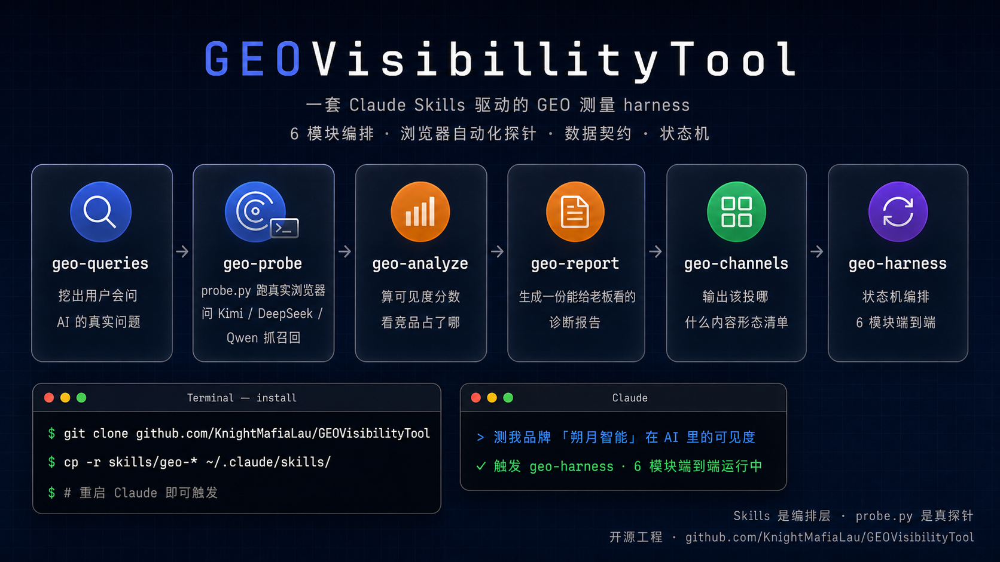
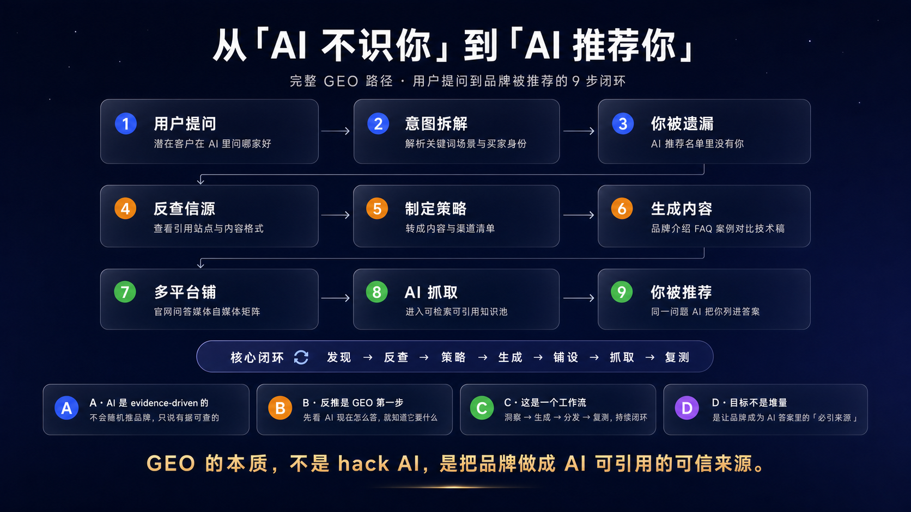

# GEOVisibilityTool

> **AI 品牌可见度测量与投放策略工具集** · 端到端 GEO(Generative Engine Optimization)分析
> 6 个 Claude Skills 组成,**测真实 LLM、出可信报告、给可执行投放建议**

[](https://github.com/KnightMafiaLau/GEOVisibilityTool)
[](LICENSE)
[](NOTICE)



---

## 一、GEO 是什么

**Generative Engine Optimization**(生成式引擎优化)—— 让品牌在 AI 搜索的回答里"被自然提到、被高位推荐、被作为 canonical source 引用"的工程化方法论。

它**不是 SEO 的升级版**。SEO 优化的是搜索引擎结果页的链接排名,GEO 优化的是 LLM 回答内容里的品牌叙述权重。两者底层逻辑根本不同:

- SEO 面向"链接被点击",GEO 面向"品牌被复述"
- SEO 的反馈是 PV / CTR,GEO 的反馈是 LLM 答案里有没有你的名字、排第几、上下文情绪如何
- SEO 是显式可衡量(后台数据齐全),GEO 必须用 probe 主动测量(LLM 答案是黑盒、动态的)

### 1.1 GEO 的完整链路(9 步闭环)



| 阶段 | 步骤 | 说明 |
|---|---|---|
| 🔵 **发现** | 1. 用户提问 | 潜在客户在 AI 里问"哪家好" |
| | 2. 意图拆解 | AI 解析关键词、场景、买家身份 |
| | 3. 你被遗漏 | AI 推荐名单里没有你 ← **GEO 缺口出现** |
| 🟠 **反查 + 策略** | 4. 反查信源 | 查看 AI 引了哪些站、什么内容格式 |
| | 5. 制定策略 | 转成内容与渠道清单 |
| | 6. 生成内容 | 品牌介绍 / FAQ / 案例 / 对比 / 技术稿 |
| 🟢 **铺设 + 复测** | 7. 多平台铺 | 官网 / 问答 / 媒体 / 自媒体矩阵 |
| | 8. AI 抓取 | 进入可检索可引用知识池 |
| | 9. 你被推荐 | 同一问题 AI 把你列进答案 |

**核心闭环**:发现 → 反查 → 策略 → 生成 → 铺设 → 抓取 → 复测

**4 条底层判断**:

- **A. AI 是 evidence-driven 的** — 不会随机推品牌,只说有据可查的
- **B. 反推是 GEO 第一步** — 先看 AI 现在怎么答,就知道它要什么
- **C. 这是一个工作流** — 洞察 → 生成 → 分发 → 复测,持续闭环
- **D. 目标不是堆量** — 是让品牌成为 AI 答案里的"必引来源"

### 1.2 GEO 的本质

> **GEO 的本质,不是 hack AI,是把品牌做成 AI 可引用的可信来源。**

整条链路可清晰分为两层:

| 层 | 解决什么 | 工具特征 |
|---|---|---|
| **测量与策略层**(步骤 1-5) | 测当前可见度、反查信源偏好、出投放策略 | 数据驱动、反复测量、判断密集 |
| **生产与分发层**(步骤 6-7) | 自动化生成内容、多站点分发、CMS 管理 | 执行密集、内容工程、流程管理 |

**本项目专注测量与策略层(步骤 1-5)**。生产与分发层(步骤 6-7)由内容团队 / 专门的 CMS 系统 / 自建分发流程承接——本项目不涉及。

完整 GEO 闭环 = 测出缺口和方向 → 团队/CMS 生产并分发 → 下一轮重新测量验证改变 → 持续迭代。

---

## 二、工具集架构

```
[用户] 一句话触发 "测我品牌 X 的 AI 可见度"
       ↓
┌─────────────────────────────────────────────────────────┐
│  GEOVisibilityTool                                       │
├─────────────────────────────────────────────────────────┤
│ ① geo-queries  生成 30 条真实用户问题                    │
│ ② geo-probe    去问真实 LLM(Qwen / DeepSeek / Kimi …)   │
│ ③ geo-analyze  算 visibility 分数 / 竞品 / 引用源画像    │
│ ④ geo-report   出 CEO 风格诊断报告(.md + .html)         │
│ ⑤ geo-channels 出投放建议(该投哪 / 什么形态 / 紧急或长期)│
│ ⑥ geo-harness  总入口编排,一句话触发全流程             │
└─────────────────────────────────────────────────────────┘
       ↓
[输出] CEO 报告 + 投放策略报告(交给内容团队执行)
       ↓
       ……(团队按建议产内容、多平台分发,~30 天后)……
       ↓
[下一轮] 用 GEOVisibilityTool 验证投放效果
```

---

## 三、6 个模块详解

### ① `geo-queries` — 生成测试问题

给一个品牌(中文名 / 行业 / 垂类 / 一句话定位 / 竞品 2-3 个),生成 **30 条真实用户问题**,按 6 类意图分布:

- **品牌识别**(q001-q005)— query 含品牌名,测 LLM 是否知道你
- **探索发现** — 用户摸索陌生领域("行业里有哪些公司?")
- **选型推荐** — 挑工具/服务("做 X 用哪个最合适?")
- **对比评估** — A vs B,结构性排除 target(用作竞品对位测量)
- **了解原理** — 普及性技术问题
- **采购投资** — B2B 找供应商 / 投资人调研

每类内部混合"短抽象"(15-40 字)和"长场景具体"(80-150 字)两种风格;严格禁复合题、禁 multiple-choice 引导式提问。

### ② `geo-probe` + `probe.py` — 真实 LLM 抓取

逐条把问题问到目标 LLM 的**网页端**(通过浏览器 MCP 操作),记下:

- 完整回答 + 命中品牌(目标 + 竞品 + 别名) + 情绪 + 排名
- **结构化引用源**(每个 LLM 一套 React fiber / DOM scrape recipe,bypass chat sanitizer 屏蔽)

内置 6 个 LLM 预设:**Kimi / 豆包 / DeepSeek / 百度文心 / 千问 / 元宝**;支持任意自定义 LLM。配套 `probe.py`(Python stdlib only,机械活)。

**核心设计**:
- q001-q005 跑完中场汇报(0 收录 / 误识别 / 正确 三种情况分别处理)
- 每条 query 强制 log,跑完 `verify-log` 检查异常(防 recipe 半吊子采集)
- 跨 query 随机 20-60 秒间隔防风控

### ③ `geo-analyze` — 算分 + 画像

读 probe-results 算 6 个核心指标:

- **Visibility Score 0-100**(加权:自然提及 40 + 识别 30 + 排名 20 + 情绪 10)
- 识别率 / 自然提及率 / 平均排名 / 推荐率 / 正向情绪率
- 竞品分布(top 10,中英文名合并)
- **引用源画像** — channel-level(域名 top 15)+ article-level(高频 URL top 10)+ per-LLM × per-intent 偏好矩阵
- 高价值零命中清单(商业意图 × 竞品占位 × 自身缺席 三条件筛)

**关键 schema 决策**:`citations` 字段存 **URL 列表(不去重)**,同域名多 URL 全保留——这是后续"广覆盖 channel vs 单篇热文 canonical source"判别的基础。

### ④ `geo-report` — CEO 视角诊断报告

把 analyze 数据渲染成给决策人看的报告。**双输出**:`.md`(可编辑)+ `.html`(自包含、带作者水印、浏览器 Cmd+P 可直接存 PDF)。

**风格设计**:
- Hero metrics 3 卡片(Visibility / 总提及 / 关键指标)
- **报忧 / 报喜双卡片**(red + green,各 3-5 条加粗短句,数据支撑)
- 竞品对比卡片 grid(自己蓝边高亮)
- LLM × 品牌 heatmap 矩阵(5 档颜色编码)
- 提示词 × LLM heatmap 矩阵
- 引用源 channel top 15 + 两 LLM 信源结构对比

**严格边界**:**不出"下一步建议 / 投放方案"** —— 那是模块 ⑤ 的事。

### ⑤ `geo-channels` — 投放策略报告

把 analysis 翻译成 actionable 投放建议。**双输出 .md + .html**,同款 CEO 风格。

**7 节结构**:
- **🔥 紧急处理**(负面 sentiment / 误识别 priority,即使无触发也保留节)
- **优先 channel 投放清单 top 10**(grid 卡片,带 ROI + 投放形态 pill)
- **Per-LLM 适配策略**(内容偏好 + 渠道偏好 双维度)
- **竞品反位攻关**(对手官网已占位 LLM 信源池 → 反位投放建议)
- **零命中 query 攻关**(每条高价值零命中 → 该投哪 + 什么内容)

**核心剔除规则**:
- 竞品官网/自有内容站绝不进 channel grid(防"推荐用户投竞品渠道")
- 搜索引擎/索引类站(patents / scholar / 百度 等)不进 grid,作为 IP 战略 signal

ROI 定性 high / med / low,公式公开,无伪精度;投放形态 mapping 14 类硬编码(知乎专栏→深度文 / smzdm→购买决策 / B站→视频 / ……)。

### ⑥ `geo-harness` — 总入口编排

**一句话触发,6 phase + 5 个用户确认门**:

```
Phase 1: 拿品牌信息 → geo-queries → queries.yaml
         [CP1: 用户审 queries]
Phase 2: 问 planned LLMs → 写 probe-plan.yaml
         [CP2: 用户确认 plan + ETA]
Phase 3: 对每个 LLM 调 geo-probe(顺序,非并行)
         [CP3 per-LLM: 跑完一个,问继续下一个]
Phase 4: geo-analyze → analysis.md
         [CP4: 用户看顶层数]
Phase 5: geo-report → report.{md,html}(自动打开)
         [CP5: 用户看 report]
Phase 6: geo-channels → channels.{md,html}(自动打开)
         [完成: 产物清单]
```

**支持断点续跑**——从测试目录现有文件状态推断当前阶段。失败绝不自动重试。所有 sub-skill 通过 Skill tool 调用,不复制内部逻辑。

---

## 四、安装与使用

### 4.1 前置要求

- **Claude Code 客户端** 或任何支持 Anthropic Skills 的 Claude 客户端
- **浏览器 MCP**:probe 阶段需要 Claude-in-Chrome 或其他浏览器 MCP(用于操作真实 LLM 网页端)
- **Python 3** stdlib(`probe.py` 用,无第三方依赖)

### 4.2 安装

```bash
# 克隆仓库
git clone https://github.com/KnightMafiaLau/GEOVisibilityTool.git
cd GEOVisibilityTool

# 装到 Claude 的 skills 目录(6 个模块)
mkdir -p ~/.claude/skills
cp -r skills/geo-queries skills/geo-probe skills/geo-analyze \
      skills/geo-report skills/geo-channels skills/geo-harness \
      ~/.claude/skills/

# 重启 Claude 客户端让 skill 列表刷新
```

### 4.3 端到端使用(推荐)

```
用户: 测我品牌 X 的 AI 可见度
Claude: [触发 geo-harness skill]
       → 问 5 项品牌信息 → 出 queries → 用户审
       → 问 planned LLMs → 写 plan → 用户确认
       → 对每个 LLM 调 geo-probe → ...
       → analyze → report(自动打开 HTML)→ channels(自动打开 HTML)
       → 完成,给产物清单
```

**典型耗时**:
- 2 个 LLM(DeepSeek + Qwen):约 60-90 分钟(probe 是主要耗时,每条 query 含 20-60 秒防风控间隔)
- 完整 4 个 LLM:约 2-3 小时

### 4.4 分模块使用(高级)

每个模块都可独立调用:

```
# 只生成测试问题(不实际 probe)
用户: 生成 GEO 测试问题
Claude: [调 geo-queries skill]

# 只对已有 probe-results 出报告
用户: 把这份 probe-results 算成 analysis
Claude: [调 geo-analyze skill,传 yaml 路径]

# 已有 analysis,只出 CEO 报告
用户: 把这份 analysis 渲染成 report
Claude: [调 geo-report skill]

# 已有 analysis,只出投放建议
用户: 出 channels 投放建议
Claude: [调 geo-channels skill]
```

### 4.5 断点续跑

```
用户: 接着跑那个品牌的 GEO 测试
Claude: [调 geo-harness skill]
       → 读测试目录 → 推断当前阶段(如 Phase 3 跑完 1/3 LLM)
       → 报当前状态 → 问"继续跑剩下的 LLM 吗?"
       → 从断点继续
```

---

## 五、产物示例

完整跑一次 harness 后,测试目录下产物:

```
my-brand/
├── queries.yaml                            # 30 条测试问题
├── probe-plan.yaml                         # 测试账本(planned LLMs + completed)
├── probe-results-deepseek-2026-05-30.yaml  # DeepSeek 30 条结果
├── probe-log-deepseek-2026-05-30.jsonl     # DeepSeek 抓取日志(verify-log 用)
├── probe-results-qwen-2026-05-30.yaml      # Qwen 30 条结果
├── probe-log-qwen-2026-05-30.jsonl
├── analysis-my-brand-2026-05-30.md         # 机器可读分析数据
├── report-my-brand-2026-05-30.md           # CEO 报告(文本)
├── report-my-brand-2026-05-30.html         # CEO 报告(HTML + 水印)
├── channels-my-brand-2026-05-30.md         # 投放建议(文本)
├── channels-my-brand-2026-05-30.html       # 投放建议(HTML + 水印)
└── probe.py                                # canonical 镜像
```

---

## 六、项目原则(Constitution)

详见 [CONSTITUTION.md](CONSTITUTION.md)。核心 6 条:

1. **模块独立可用** — 每个 skill 单独装上就能产生价值
2. **不强制 API key** — 默认路径不要求用户配 OpenAI / Anthropic 等 key
3. **用户先确认再动外部资源** — 跑真 LLM、下载文件等操作必须先确认
4. **SDD 是工具不是负担** — 不堆 spec.md / plan.md / research.md 文档矩阵
5. **不假装、不糊弄** — 不编结果、不绕过确认、不假装跑通
6. **模块形态:纯 skill 或 skill + 单个 Python 文件** — Python 仅做机械活、stdlib only、≤ 150 行

完整路线图见 [TASKS.md](TASKS.md)。

---

## 七、License 与 Attribution

本项目采用 **Apache License 2.0**(完整文本见 [LICENSE](LICENSE)),附 [NOTICE](NOTICE) 文件说明 attribution 义务。

### ✅ 您可以(自由)

- **自由使用** — 包括商业用途
- **修改 / 二次开发** — 适配、fork、定制
- **分发** — 原版或修改版
- **商业化变现** — 基于本项目开发付费服务或商业产品

### ⚠️ 您必须(强制)

1. **保留原作者署名 `KnightMafiaLau`**
   - 任何分发的源代码必须保留 `LICENSE` 和 `NOTICE` 文件
   - 任何衍生的用户文档必须注明原始来源(本仓库 URL)
   - 任何引用本方法论的文章 / 演讲 / 商业资料必须给出 attribution

2. **绝不移除或修改 HTML 报告中的水印**
   `GEOVisibilityTool · KnightMafiaLau` 是独立于 license notice 的 attribution 机制。
   - 移除水印 = attribution 违约
   - 修改水印文本 = attribution 违约
   - 替换为自家水印 = attribution 违约
   - **您可以**在原水印旁加上自家组织 logo,但**不能**替换或隐藏原水印

3. **明确声明修改**(Apache 2.0 §4(b))
   分发修改版本时,必须明确标注您修改了哪些部分,防止下游用户误以为是原版。

### 强制声明

> 本工具集 (`GEOVisibilityTool`) 由 **KnightMafiaLau** 创建并持续维护。
>
> 任何使用、修改、分发、商业化本工具或其衍生产物的行为,均必须明确注明:
>
> > **"基于 GEOVisibilityTool(作者:KnightMafiaLau,
> > https://github.com/KnightMafiaLau/GEOVisibilityTool)"**
>
> 该署名要求适用于代码层(源码 NOTICE 文件)、文档层(技术文章 / 演讲 / 商业资料)、
> 以及产物层(HTML 报告内嵌水印)三个维度。任一维度的 attribution 缺失均视为违反 Apache 2.0 §4 条款。

---

<sub>**GEOVisibilityTool** · Copyright © 2026 [KnightMafiaLau](https://github.com/KnightMafiaLau) · Apache License 2.0 · 问题反馈与 PR 欢迎</sub>
